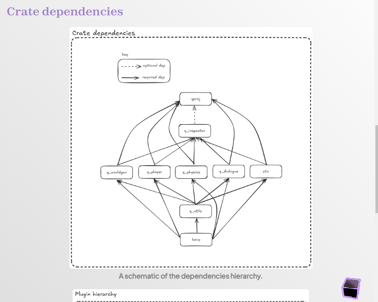
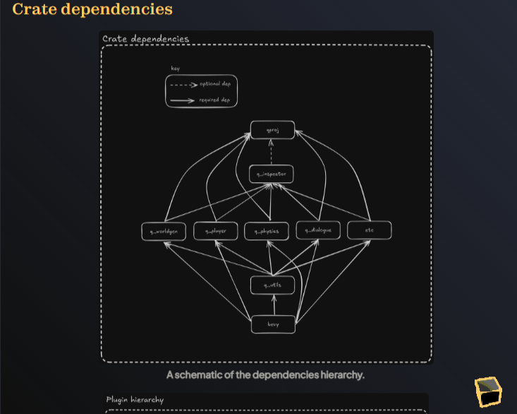
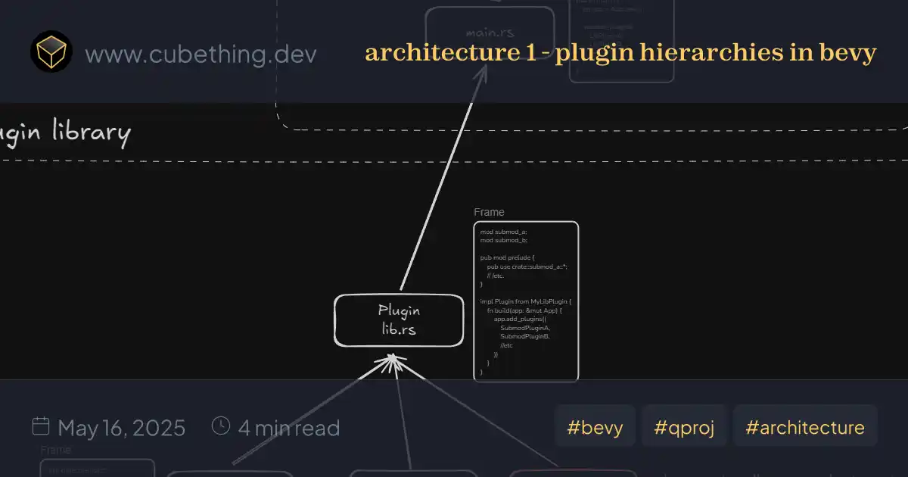
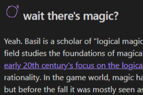

# cubething-quartz

This is a fork of [Quartz v4](https://quartz.jzhao.xyz).

I use Obsidian to handle my notes, and since I develop on WSL2, and Obsidian can't handle WSL2 links, I needed a submodule.

## Why use Quartz?

I've grown quite tired of maintaining both the front-end and the content. If I'm blogging, I just want to write the dang content! That's hard enough! Quartz is flexible, high-quality, compatible with Obsidian, and easy to extend. That's good enough for me!

## Additional features

Quartz has a lot of features and a nice plugin system! I've added a few.

### Style-dependent figures

Figures with captions. This creates figures with optional captions and links to the full image. If there is a similar image with the -dark postfix, then this plugin will automatically create a light-only and dark-only version of the figure.




### opengraph previews with hero images

If there is a cover image specified in the frontmatter, add it as the _background_ of the otherwise similar opengraph preview image.




### lilguys

The lilguy transformer plugin lets me add a gif of a lilguy in obsidian, which will then be replaced with a version appropriate to the current color scheme.

")
")


### mobile styling improvements

Added a little cube in the bottom-right hand corner on mobile screen sizes. Clicking on this will open a modal with the explorer, table of contents, and backlinks. The modal can be dragged down to close.


### submodule content w/ automatic sync

Content exists separately from the main repo, so I don't have to update the entire thing!

I've set up automatic syncing of content in github actions. The contents of that submodule are private, but this repo is public! This way I can keep my drafts _secret_ 😈

### multiple subdomains with environment-based configuration

I would like to have a subdomain for each separate Quartz-based project I write without having to fork this repository every time. Yuck! In order to do that, I've set up .env files to configure the application depending on the subdomain. These env vars will be configured in CI so that they publish to wherever is required.

Local builds are built like this:

```sh
$ npx dotenvx -f env/.env.local -- npx quartz build --serve
```

... and .env.local looks like this:

```sh
BASE_URL="www.cubething.dev"
CONTENT_DIRECTORY="content.local/main"
OUTPUT_DIRECTORY="out/local/main/public"
```

Every submodule will need to be set up with a deploy key _per subdomain_. So if I have subdomains `www` and `example`, then I would need to add a deploy key for `www.site.com` and `example.site.com` to _both_ the `www` submodule and `example` submodule.
